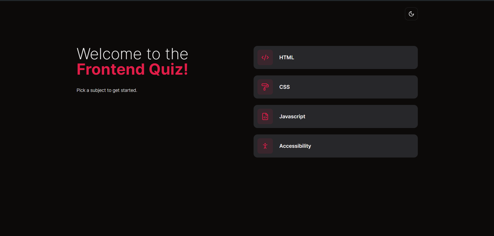
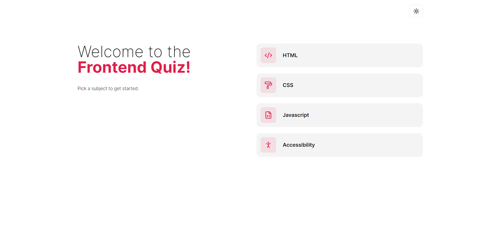

# Frontend Quiz Web App

Welcome to the Frontend Quiz Web App! This application is designed to test your knowledge of frontend development concepts in a fun and interactive way. Whether you're a beginner or an experienced developer looking to refresh your skills, this quiz app is for you.

## Features

- **10 Questions:** The quiz consists of 10 multiple-choice questions on various frontend development topics.
- **Interactive Interface:** User-friendly interface for seamless navigation through the quiz.
- **Score Tracking:** Keep track of your score as you progress through the quiz.
- **Instant Feedback:** Receive immediate feedback on your answers to learn and improve.
- **Dark and Light Mode:** Choose between dark and light mode themes for comfortable viewing.

## Technologies Used

- Next.js (Frontend Framework)
- Tailwind CSS (CSS Framework)
- Zustand (State Management)
- shandcn/ui (UI Components)

## Instructions

1. Read each question carefully.
2. Select the answer you believe is correct.
3. Click the "Next" button to proceed to the next question.
4. After completing all questions, click the "Submit" button to see your final score.

## Dark and Light Mode

_Dark Mode: Enhance your quiz experience with a sleek dark theme._

_Light Mode: Opt for a classic light theme for a comfortable viewing experience._

## Deployment

This quiz app is deployed on Vercel. You can access the live version by visiting [Quiz App](https://fquiz-eight.vercel.app/).

## Credits

- Frontend Quiz Web App was created by Sagar Dwivedi & Inspiration from FrontedMentor.
- Dark and light mode screenshots are from the actual application.

## Feedback and Contributions

If you have any feedback, suggestions, or would like to contribute to the project, feel free to reach out to sagar.dw20@gmail.com

Thank you for using the Frontend Quiz Web App! Happy quizzing!
